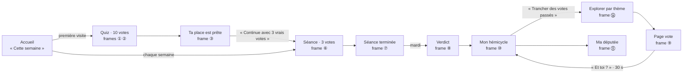

# Cadrage : à quoi sert le site, d'après les maquettes V5

> Rédigé le 8 octobre 2026 après les retours de Julien sur t22 (« on ne sait pas réellement où on va »). Source : les 19 frames du fichier de maquettes V5, lues écran par écran (textes, enchaînements, données affichées). Ce document dit ce que l'utilisateur fait sur le site, ce dont chaque écran a besoin, où le site actuel s'en écarte, et l'ordre de construction proposé. **Validé par Julien le 8 octobre 2026** : lots de 3 votes, une séance passée devient un lot, le contenu avant la séance. Le planning en tient compte (phase 2 bis, t42 à t45).

## 1. Le principe en une phrase

**Chaque vote de l'Assemblée devient une question simple, que l'on tranche en 30 secondes ; chaque réponse place l'utilisateur un peu plus précisément dans l'hémicycle ; chaque semaine, il vote avant les députés et découvre le verdict.**

Trois idées portent tout le reste :

1. **L'unité du site est la carte de vote**, pas le scrutin officiel. Dans toutes les frames, un vote apparaît sous la même forme : un thème (« Logement »), un titre court (« L'encadrement des loyers prolongé »), une question fermée (« Faut-il prolonger l'encadrement des loyers ? »), une phrase « Concrètement », puis les 3 cartes « Ce que ça change ». Le titre officiel (« l'ensemble de la proposition de loi visant à… ») n'apparaît jamais en premier : il est dans « Pour aller plus loin ».
2. **Ta place est le fil rouge.** Le quiz la crée, la séance la précise, Explorer l'affine, le verdict la confronte aux députés. La jauge de précision (fiable vers 25 votes) dit à l'utilisateur où il en est. Chaque écran se termine par un geste qui fait bouger cette place.
3. **Peu de temps, un rendez-vous.** 2 minutes par séance, 40 secondes par vote, une séance par semaine, un verdict le mardi. Le site n'est pas un annuaire de scrutins : c'est un rituel hebdomadaire.

## 2. Les trois parcours

**Première visite (« Jade », 3 minutes).** Accueil → quiz de 10 votes, avec la révélation du vrai vote après chaque réponse → « Ta place est prête » : le groupe le plus proche, le jumeau, la précision (39 % après 10 votes) → **un seul bouton principal : « La séance de la semaine → Continue avec 3 vrais votes »**, et « Partager ». Le résultat n'envoie ni vers Explorer ni vers une liste : il enchaîne.

**Chaque semaine (2 minutes, puis le verdict).** Le lundi, l'accueil propose la séance : 3 votes solennels annoncés à l'agenda, à trancher avant les députés, avec un pronostic facultatif. Fin de séance : le tampon, la série de semaines, la précision qui monte (« +8 points »), le rendez-vous du verdict. Le mardi, le verdict : adopté ou rejeté, à combien de voix près, ce qu'ont voté ta députée et ton jumeau. Le dimanche, le récapitulatif (reporté avec les comptes).

**À la demande.** Mon hémicycle → « Trancher des votes passés » → Explorer, rangé **par thème**, avec pour chaque thème ce que l'utilisateur a déjà tranché (« 12 votes · 4 tranchés ») ; chaque vote se tranche en 30 secondes. Et « Qui te représente ? » : le code postal mène à la fiche de son député, ses votes face aux siens.

## 3. Ce que chaque écran attend

| Frame | Rôle | A besoin de | État au 8 octobre |
|---|---|---|---|
| ① ② Quiz | créer la place | 10 cartes de vote | fait (t21), recopié |
| ③ Résultat | montrer la place, **enchaîner** | la séance ou un lot de votes | fait, mais le bouton principal mène à Mon hémicycle faute de suite |
| ④ Partage, stories | faire venir d'autres gens | — | fait, sans duel (reporté) |
| ⑤ Accueil | le rendez-vous de la semaine | séance, verdicts récents **en cartes de vote** | refait « avec ce qui existe » : votes affichés par leur titre officiel |
| ⑥ ⑦ Séance | trancher 3 votes avant eux | agenda + 3 cartes de vote par semaine | à faire (t23, t24) |
| ⑧ Verdict | confronter au vrai vote | passages horaires des soirs de scrutin | à faire (t25) |
| ⑨ Page vote | comprendre un vote, en 3 couches | carte de vote + « Ce que ça change » | faite, mais sans carte : question absente, titre officiel en tête |
| ⑩ Mon hémicycle | voir sa place, l'affiner | votes passés à trancher | recopié ; « Trancher des votes passés » mène à une liste de titres officiels |
| ⑪ Ma députée | son député face à soi | code postal | fait (t19) |
| ⑫ Suivre une loi, ⑬ Duel | revenir, partager | comptes | reportés (décision du 7 octobre) |
| ⑭ Explorer | trancher par thème | **thèmes et cartes de vote** | fait par type de vote (thèmes en t28) |

**Ce qui manque n'est pas un écran : c'est le contenu.** Presque tous les écarts restants avec les maquettes (accueil, page vote, Explorer, la suite du quiz) viennent de la même absence : hors des 10 votes du quiz, aucun vote n'a encore sa carte (thème, titre court, question, « Concrètement »). Le planning prévoyait de les rédiger en phase 4 (t27, mi-décembre), après la séance. Les maquettes disent l'inverse : la carte de vote est la matière de tous les écrans, elle doit venir d'abord.

## 4. Les lots de votes (décision de Julien du 8 octobre : option a)

Julien a choisi : des lots de questions rédigés chaque semaine, et **5 lots prêts au lancement** pour que l'utilisateur puisse aller au bout de son placement.

**Retenu (Julien, 8 octobre) :**

- **Un lot = 3 votes, au format d'une séance** (3 cartes, environ 2 minutes, avec la révélation de chaque vote comme dans le quiz). 10 votes du quiz + 5 lots de 3 = **25 votes : le seuil où la précision devient fiable** (1 − e^(−25/20) ≈ 71 %). L'utilisateur qui va au bout des 5 lots a une place fiable. *(Variante : des lots de 5, comme le duel des maquettes ; 35 votes au total, plus long à produire.)*
- **Une séance passée devient un lot.** Chaque semaine, la session de rédaction produit les cartes des 3 votes de la séance ; une fois le verdict tombé, la séance rejoint les lots « à rattraper ». Le stock grandit tout seul, sans deuxième chaîne de production. Au lancement, les 5 premiers lots sont des séances « rétroactives », tirées des votes de juin et juillet 2026.
- **Des lots choisis pour départager.** Les votes des lots sont choisis pour séparer les groupes que le quiz distingue mal (Dem et EPR, Dem et LIOT ne sont séparés qu'une fois), avec des thèmes variés et des sujets compris en une phrase, comme pour le quiz (critères de Julien du 8 octobre).
- **Production.** Mêmes contrôles que le quiz et les fiches (docs/vulgarisation-controles.md), validation de Julien, zéro euro. 6 candidats du quiz déjà rédigés et contrôlés n'ont pas été retenus (n° 2958, 5106, 7905, 881, 852, 7380) : il en faut 9 de plus pour 5 lots.

## 5. Règles pour décider, tirées des maquettes

Quand une question de conception se pose, la réponse se cherche dans ces règles avant de coder :

1. **Le vote se présente par sa question.** Thème, titre court, question, « Concrètement » ; le titre officiel en troisième couche. Sans carte, le vote est affiché, mais il ne se tranche pas en première ligne.
2. **Un écran, une action principale** (le gros bouton violet), une action secondaire au plus. Tout le reste est en lien discret.
3. **Chaque réponse fait bouger quelque chose de visible** : la précision, un siège de l'hémicycle, la série.
4. **Trancher se fait en mode focus**, sans navigation ; consulter se fait dans le site. Une séance tient en 2 minutes.
5. **Tout ramène à ta place** : Mon hémicycle est le centre ; chaque écran y conduit.
6. **Ce qui n'existe pas est caché, jamais simulé.** Pas de série, de pronostic ou de loi suivie fictifs : l'écran se resserre sur ce qui est réel.
7. **Neutralité** : aucun axe gauche-droite, des groupes reconnaissables par la couleur que leur donne l'Assemblée, des faits sourcés.
8. **Recopier la frame**, ses cotes et ses textes, et noter chaque écart avec sa raison.

## 6. Ordre de construction (validé le 8 octobre)

Le planning actuel fait : séance (t23–t26), puis cartes de vote (t27), puis thèmes (t28). Proposition : **le contenu d'abord**.

1. **Cartes de vote et 5 lots.** Format de la carte (thème, titre court, question, « Concrètement ») ; 15 votes rédigés, contrôlés et validés par Julien ; thème attribué à chaque carte. *(Avance une partie de t27 et de t28.)*
2. **Le moteur de séance**, sur les lots : l'écran de la frame ⑥ sans pronostic, puis ⑦ (tampon, précision gagnée). Le bouton du résultat du quiz devient « Continuer · 3 votes de plus » ; « Trancher des votes passés » mène au prochain lot.
3. **L'accueil (⑤) refait** sur ces cartes : la carte « séance » (le lot à rattraper en attendant la vraie séance), « Les verdicts de la semaine dernière » en titres courts avec « Tu avais voté pour · du côté de la majorité », ton hémicycle, ton député cette semaine. Les blocs reportés (loi suivie, duel) disparaissent, et la mise en page se resserre.
4. **La vraie séance de la semaine** : agenda, sélection des 3 votes, verdict (t23, t25, t26 inchangées) ; chaque séance alimente ensuite les lots.
5. **Explorer par thème (⑭) et page vote (⑨) avec la carte en tête.**
6. La session hebdomadaire de rédaction (t27) devient la routine qui produit les 3 cartes de la séance, plus un lot tant que le stock est bas.

## 7. Décisions de Julien (8 octobre)

1. Un lot = **3 votes** (10 + 15 = 25).
2. Une séance passée **devient un lot** à rattraper.
3. **Le contenu d'abord** : phase 2 bis du planning (t42 à t45), avant la séance de la semaine.
4. Les votes des lots : Claude Code propose des candidats (t42), Julien en retient 15 (t43), comme pour le quiz.
